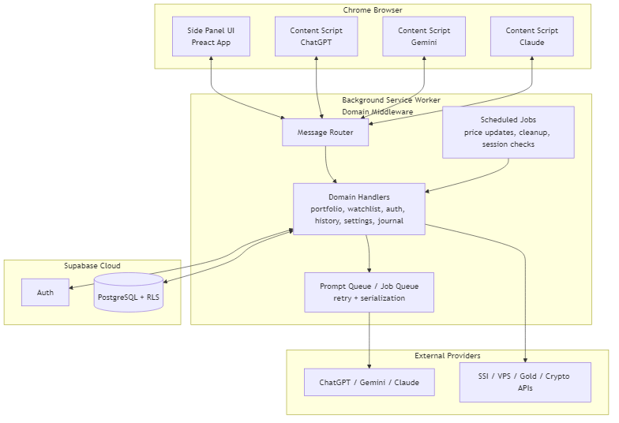

# Assistant8 Chrome Extension

Assistant8 is a Chrome Manifest V3 extension that combines AI-assisted workflows with personal finance tooling in a single side-panel experience.

## Project Scope

The project covers three core domains:

- AI productivity workflows: send prompts to ChatGPT/Gemini/Claude, context-menu analysis, writing assistant templates, and prompt orchestration.
- Investment and personal finance operations: portfolio tracking, watchlists, market data updates, net worth aggregation (including assets like gold/crypto/debt), and trading journal workflows.
- User data and operations platform: Supabase-backed authentication, settings, chat history, error tracking, and data import/export.

## Architecture Overview

Assistant8 uses a three-layer architecture designed for Chrome MV3 constraints:



1. Side Panel UI (Preact)
- Renders the full user interface.
- Sends typed runtime messages for all business operations.
- Does not directly persist business data locally.

2. Background Service Worker (Domain Middleware)
- Central orchestration layer for commands, auth checks, retries, alarms, and provider routing.
- Handles communication with content scripts and external providers.
- Implements stateless request handling so it is safe across service worker restarts.

3. Supabase Cloud (Auth + PostgreSQL)
- System of record for user business data.
- Row Level Security (RLS) isolates tenant data by user id.
- Auth session is persisted via the Chrome storage adapter required by MV3 service workers.

High-level flow:

UI <-> chrome.runtime messaging <-> Background Service Worker <-> Supabase

Content scripts (ChatGPT/Gemini/Claude pages) are controlled by the background layer for DOM automation and response collection.

## Key Runtime Principles

- MV3-safe lifecycle: listeners are registered synchronously at top level.
- Stateless background handlers: no critical in-memory persistence.
- Data boundary: permanent business data in Supabase, not local browser storage.
- Reliability patterns: retry/backoff for transient failures and scheduled alarms for periodic jobs.

## Technology Stack

- Chrome Extension: Manifest V3, sidePanel, alarms, contextMenus, scripting, tabs.
- UI: Preact + Signals.
- Build tooling: Vite.
- Backend services: Supabase Auth + PostgreSQL.
- Testing: Vitest (unit) and Playwright (e2e).

## Repository Entry Points

- Extension manifest: src/extension/manifest.json
- Background entry: src/background/index.js
- Side panel app entry: src/ui-preact/settings/index.jsx
- Core content script: src/content.js

## Development

Install dependencies:

```bash
npm install
```

Build production extension artifacts:

```bash
npm run build
```

Run unit tests:

```bash
npm run test:unit:run
```

Run e2e tests:

```bash
npm run test:e2e
```
