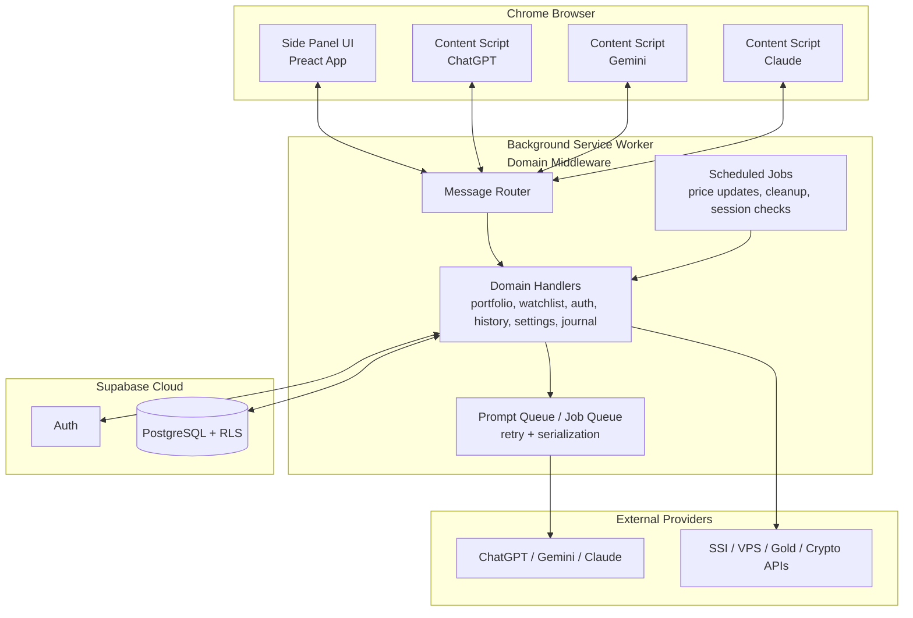

# Assistant8 Architecture Overview

This document describes the runtime architecture and scope boundaries of the Assistant8 Chrome Extension (Manifest V3).

## Scope Boundaries

Assistant8 is designed around three product domains:

- AI workflow orchestration: provider routing, prompt execution, context-menu analysis, and writing/research assistants.
- Finance operations: portfolio/watchlist management, market-data refresh jobs, and net-worth aggregation.
- User data platform: Supabase auth, persistence, chat history, settings, and audit/error records.

The extension does not use local browser storage as a permanent business datastore. Durable user data is persisted in Supabase.

## High-Level Architecture

## Core Runtime Flow

1. UI or content scripts send typed messages to the background service worker.
2. The message router dispatches requests to domain handlers.
3. Handlers enforce auth/session requirements and validate payload contracts.
4. Prompt and automation work is serialized via queue services to avoid tab/DOM race conditions.
5. Durable records are persisted in Supabase with user-level isolation through RLS.
6. Alarm-driven jobs execute periodic maintenance and market refresh tasks.

## Design Principles

- MV3-safe lifecycle: listeners are registered synchronously at top level.
- Stateless background processing: requests are independent and recoverable.
- Durable data in Supabase: no permanent business data in local storage.
- Contract-first messaging: shared message schema for cross-context consistency.
- Failure tolerance: retry/backoff for transient provider/network errors.
