# Sơ đồ kiến trúc dự án (Mermaid) — cập nhật: mọi prompt đi qua promptQueue

Tệp này chứa sơ đồ Mermaid mô tả kiến trúc cao cấp của extension. Phiên bản này làm rõ: mọi thao tác gửi prompt đến ChatGPT (SEND_PROMPT, CHATGPT_SEND_INPUT, context menu sends, v.v.) phải đi qua hàng đợi thống nhất (`promptQueue`).

```mermaid
flowchart LR
  subgraph Browser[Browser / UI]
    Page[Browser Page]
    Content["Content Script src/content.js"]
    UI["Sidepanel UI - Preact<br/>src/ui-preact/App.jsx"]
  end

  subgraph Background[Background Service Worker src/background/index.js]
    Router[Message Router src/background/messageRouter.js]

    subgraph Handlers["Handlers (src/background/handlers/*)"]
      Prompts[Prompts Handler src/background/handlers/prompts.js]
      Watchlist[Watchlist Enrich Handler src/background/handlers/watchlistEnrich.js]
      Portfolio[Portfolio Handler src/background/handlers/portfolio.js]
      Assets[Assets Handler src/background/handlers/assets.js]
    end

    subgraph Services["Services / Queues (src/background/services/*)"]
      PromptQ[Prompt Queue src/background/services/promptQueue.js]
      EnrichQ[Enrichment Queue src/background/services/enrichmentQueue.js]
      ChatHist["Chat History Service<br/>src/background/services/chatHistoryService.js"]
    end

    Platform[Platform Adapters src/platform/messaging.js src/platform/storage.js]
    Shared[Shared Schemas / Templates src/shared/messageSchema.js]
  end

  subgraph External[External Services / DB]
    Supabase["Supabase (Auth / DB)<br/>src/supabaseConfig.js"]
    ChatGPT["ChatGPT / LLM Session<br/>src/chatgptSession.js"]
    Market["Market & Commodity Providers<br/>src/market-data/*<br/>src/commodity-data/*"]
  end

  %% Data flow arrows
  Page -->|page DOM interactions| Content
  UI -->|runtime messaging| Router
  Content -->|runtime messaging| Router

  Router -->|route messages to| Handlers
  Handlers -->|enqueue / call| Services
  Services -->|call / persist| External
  Router -->|use| Platform
  Handlers -->|use| Shared
  UI -->|uses| Platform

  %% Notes
  classDef note fill:#fff7cc,stroke:#f2c94c
  note1["Queues handle retry, rate-limit, persistence Message schema enforces contract between components"]:::note
  Services --- note1
  Shared --- note1

  %% Highlight important queues
  PromptQ -.->|throttle / retry| ChatGPT
  EnrichQ -.->|fetch market data| Market
  ChatHist -.->|persist chat| Supabase

  %% Legend
  subgraph Legend[Key files referenced]
    L1["src/extension/manifest.json"]----L2["src/extension/sidepanel-preact.html"]
  end
```

Giải thích ngắn gọn:
- Mục tiêu thiết kế: mọi thao tác gửi tới ChatGPT đều phải đi qua hàng đợi thống nhất (`promptQueue`) để tránh xung đột DOM automation trên tab ChatGPT và để hỗ trợ retry / persistence cho các tác vụ nền.
- Thực tế trong mã: xem [`src/background/handlers/prompt.js`](src/background/handlers/prompt.js:16) — handler rõ ràng ghi: "All prompt sends are serialized through p-queue (concurrency=1). The handler awaits its turn in the queue before sending." và [`src/background/services/promptQueue.js`](src/background/services/promptQueue.js:1) — header mô tả 2 API: `enqueue` (sync) và `enqueueBackgroundJob` (fire-and-forget, persisted).

Hành động tiếp theo (tùy bạn):
- Nếu muốn tôi có thể render Mermaid thành PNG/SVG và thêm vào repo (ví dụ `docs/browser_extension_arch.png`).
- Hoặc tôi có thể tạo một sơ đồ chi tiết hơn (tách handlers theo domain) nếu cần.
